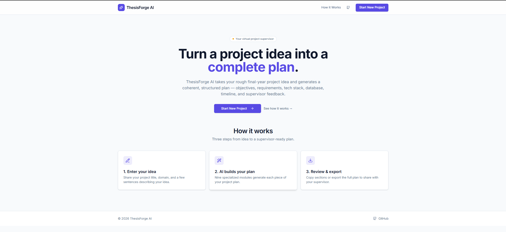
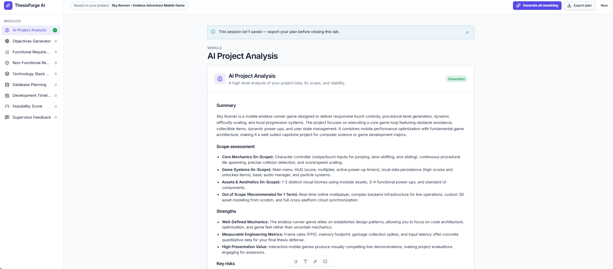

# ThesisForge AI

An AI-powered web application that helps university students generate complete Final Year Project (FYP) documentation using Generative AI.

---

# Problem Statement

Preparing Final Year Project documentation is one of the most time-consuming tasks for university students. Students often spend days writing project analysis, objectives, requirements, database planning, timelines, and feasibility reports before they can even begin development.

**ThesisForge AI** solves this problem by automatically generating well-structured academic project documentation from a simple project description. The platform acts as an intelligent documentation assistant, helping students prepare professional project reports quickly while still allowing them to edit and refine the generated content.

The application is designed for undergraduate students preparing capstone or Final Year Projects.

---

# Live Demo

**Live Application**

https://thesis-forge-ai-five.vercel.app/

---

# Features

- AI-powered Project Analysis
- Automatic Project Objectives Generation
- Functional Requirements Generator
- Non-Functional Requirements Generator
- Technology Stack Recommendation
- Database Planning
- Development Timeline Generation
- AI-powered Feasibility Score
- Virtual Supervisor Feedback
- Markdown-based Documentation Rendering
- Export Generated Documentation
- Progress Tracking Across Documentation Modules
- Responsive User Interface
- Error Handling for AI Requests

---

# AI Feature

ThesisForge AI integrates Google's Gemini AI to automatically generate software engineering documentation.

Users provide:

- Project Title
- Project Domain
- Project Idea
- Project Constraints

The application then generates multiple documentation modules using carefully engineered system prompts.

Generated modules include:

- AI Project Analysis
- Project Objectives
- Functional Requirements
- Non-Functional Requirements
- Technology Stack Recommendation
- Database Planning
- Development Timeline
- Feasibility Assessment
- Supervisor Feedback

---

# AI System Prompt

Each documentation module uses its own dedicated system prompt.

Example:

> You are ThesisForge AI, an expert final-year (capstone) project advisor for university students. Write in clear, academic English and generate structured software engineering documentation in GitHub-flavoured Markdown. Every module should be concise, practical, and suitable for an undergraduate Final Year Project.

Different prompts are used for each module to generate specialized documentation such as project objectives, database plans, timelines, feasibility analysis, and supervisor feedback.

---

# Technologies Used

## Frontend

- React
- TypeScript
- TanStack Router
- TanStack Start
- Tailwind CSS
- shadcn/ui
- Lucide React Icons

## Backend

- TanStack Server Functions
- Node.js

## AI

- Google Gemini API
- Gemini Flash Model
- Google AI Studio

## Deployment

- Vercel

## Development Tools

- Visual Studio Code
- Git
- GitHub
- npm

---

# Project Screenshots

## Home Page



---

## New Project Form


---

## Workspace



---

## Generated Documentation


---

# How to Run the Project

Clone the repository

```bash
git clone https://github.com/Abbas-512/ThesisForge-AI.git
```

Move into the project directory

```bash
cd ThesisForge-AI
```

Install dependencies

```bash
npm install
```

Create a `.env` file inside the project root and add your Google Gemini API key

```env
GEMINI_API_KEY= YOUR_API_KEY  

"Enter a valid API key if running on local host as it has not been committed in git / vercel app however is working with free-tier Google AI-studio generated key"

```

Start the development server

```bash
npm run dev
```

Build for production

```bash
npm run build
```

---

# Project Structure

```
src/
│
├── components/
├── lib/
├── routes/
├── styles/
└── server/
```

---

# Known Limitations

This project uses the **Google Gemini API (Google AI Studio Free Tier)**.

The free-tier API is subject to request and quota limits imposed by Google. During periods of heavy usage or when many documentation modules are generated consecutively, the API may temporarily return an **HTTP 429 (Too Many Requests / Resource Exhausted)** response.

This limitation originates from the external AI service rather than the application itself.

### Recommended Usage

- Generate documentation modules individually for the most reliable experience.
- If a temporary quota limit is reached, wait a few minutes before retrying.
- For production deployments, a paid Gemini API plan or another AI provider with higher request quotas is recommended.

---

# Security

- API keys are **never** committed to the repository.
- Environment variables are used for sensitive credentials.
- `.env` files are excluded using `.gitignore`.
- The deployed application securely accesses the Gemini API through server-side functions.

---

# Future Improvements

- User Authentication
- Multiple Project Management
- Project History
- PDF Export
- DOCX Export
- Supervisor Collaboration
- Cloud Database Integration
- Additional Documentation Modules
- Support for Multiple AI Providers
- Custom Prompt Templates

---

# Repository

GitHub Repository

https://github.com/Abbas-512/ThesisForge-AI.git

---

# Author

**Syed Hasnain Abbas Shah Zaidi**

University of Gujrat (BSIT batch:2020 - 2024)

Individual Academic Project

---

# License

This project was developed solely for educational purposes as an individual university assignment.